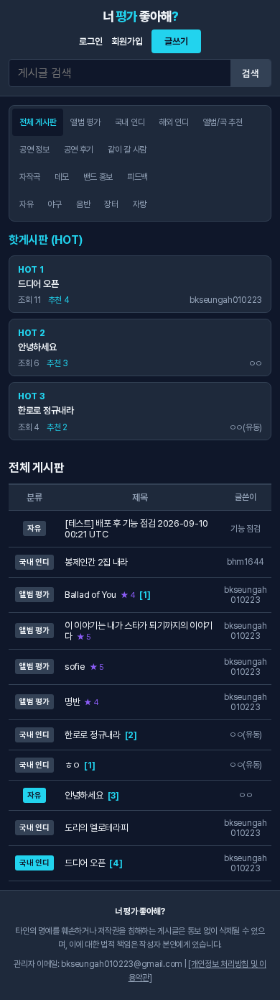
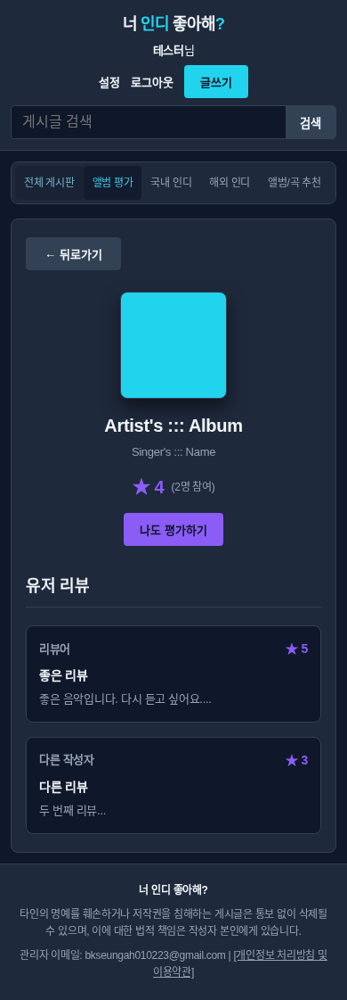

# 모바일 레이아웃 수정

## 문제와 수정

실서비스에서 390px 화면의 문서 폭이 696px까지 늘어났다. `1fr` grid track의 자동 최소 너비, 게시판 표의 600px 최소 너비, 고정 폭 열, 가로로 나열된 메뉴/HOT 카드가 작은 화면을 밀어냈다.

- Grid track을 `minmax(0, 1fr)`로, 자식 요소를 `min-width:0`으로 설정했다.
- 게시글 표는 화면 폭에 맞추고 긴 텍스트는 셀 안에서 줄바꿈한다. 표에는 가로 스크롤을 추가하지 않는다.
- 작은 화면의 게시판 메뉴와 HOT 카드는 원래 의도대로 가로로 나열한다. 메뉴·HOT 각각에 `overflow-x:auto`와 `overscroll-behavior-x:contain`을 적용해 영역 내부에서만 가로 스크롤한다. HOT 카드 폭은 240px이다. 페이지 전체의 `overflow-x:hidden`으로 문제를 숨기지 않았다.
- 긴 닉네임은 헤더 안에서 말줄임하고, 긴 제목·작성자·URL은 콘텐츠 영역 안에서 줄바꿈한다.
- 선택 앨범, 별점, 글쓰기 도구/버튼과 모달이 좁거나 낮은 화면에도 들어가도록 크기와 줄바꿈을 조정했다. 모달은 필요 시 세로로 스크롤한다.
- 모바일 제목 22→18px, 앨범명 26→20px, 평균 평점 24→20px, 리뷰 제목 16→14px로 줄였다. 본문은 14px/1.7 line-height, 입력창은 16px로 유지한다.
- viewport는 `width=device-width, initial-scale=1.0, minimum-scale=1.0`을 사용한다. 기본 배율보다 작게 축소하지 않도록 요청하고 확대 상한은 두지 않는다. 이 설정은 페이지 전체에 적용되며 iOS Safari 등은 최소 배율 제한을 무시할 수 있다. 실제 기기의 pinch 동작은 별도 확인이 필요하다.

## 검증

- `npm test`: **44/44 PASS**: 기존 기능·XSS 테스트.
- `npm run test:layout`: **51/51 PASS**: 3개 엔진(Chromium/Firefox/WebKit) × 17개 케이스.
- `npm run test:baseline`: **4/4 PASS**.
- 12개 화면 크기: 320×568, 360×800, 375×667, 390×844, 430×932, 600×800, 768×1024, 840×900, 841×900, 844×390, 1024×768, 1440×900.
- 추가 케이스: 화면 회전/resize, 모바일 font-size, 확대 허용 viewport 설정, 200% CSS zoom. 320/390/600/840px에서 메뉴와 HOT 영역의 끝까지 스크롤한 뒤 문서 폭 유지와 HOT·게시글 클릭도 확인한다. 게시글 표는 스크롤 없이 화면에 맞는지도 검사한다.
- 목록·상세·이미지·YouTube·앨범·리뷰·미리 선택된 글쓰기·검색 결과·설정/로그인/회원가입/약관 모달에서 문서와 주요 컨테이너의 가로 넘침 및 viewport 밖의 조작 요소를 검사한다.
- 긴 한글/띄어쓰기 없는 문자열/닉네임과 1600px 이미지로 확인했다. 테스트는 로컬 mock만 사용한다.
- 실제 fork Pages에서도 모바일 목록/게시글/앨범 상세의 문서 폭이 viewport와 일치하는지 확인했다.

초기 검증에서 긴 닉네임의 헤더 팽창, 확대 시 표 너비 문제를 발견해 수정했다. Firefox가 기존 PNG fixture의 손상을 감지해 유효한 PNG로 교체했다. WebKit 실행에 필요한 라이브러리는 시스템 관리자 권한 없이 로컬 browser cache에 준비했다. 실제 휴대폰 하드웨어나 모든 OS/browser 버전을 검증했다는 의미는 아니다.

## 미리보기와 PR

미리보기: https://thirdcat.github.io/indie/

`thirdcat/indie`의 `preview` 브랜치에는 `index.html`과 `.nojekyll`만 배포한다. 원본 도메인의 `CNAME`을 포함하지 않으며 GitHub Pages custom domain은 설정하지 않는다. 모바일 소스 변경은 fork의 `fix/mobile-layout` 브랜치에서 관리한다. 사용자가 미리보기를 확인하고 요청한 뒤 원본 main으로 PR을 보낸다. 미리보기 배포 브랜치를 원본 main에 병합하지 않는다.

미리보기는 원본과 같은 Supabase를 사용하므로 글·계정·이미지 데이터가 공유되고, 글을 열면 조회수가 증가할 수 있다. UI 변경만 미리보기에서 확인하며 서버 정책·HTTPS 설정은 이 변경에 포함하지 않는다.

## 화면 예시

게시판 이미지는 로컬 mock 데이터로 촬영했다.

## 빈 게시판 열 너비 보정

모바일에서 번호·날짜·조회·추천 열을 숨겨 3개 열만 보이는데, 빈 상태의 `colspan="7"`이 추가 열을 만들어 제목 폭이 달라졌다. 로딩/빈 상태 안내 행을 모바일 3열과 desktop 7열로 나누고 CSS breakpoint에서 하나만 표시한다. 기존 열 너비(모바일 분류·글쓴이 각각 72px, 제목은 나머지)는 유지한다.

수정 전 Chromium 모바일 320/390/840px에서 열 너비 비교 테스트 실패를 재현했다. 수정 후 `npm run test:layout -- --grep 'empty boards'`는 3개 엔진 × 5개 폭(320/390/840/841/1280px), **15/15 PASS**다. `npm test -- --grep 'empty states'`도 **2/2 PASS**이며 runtime/console 오류는 없었다. 서버 요청은 로컬 mock으로 대체했다.
